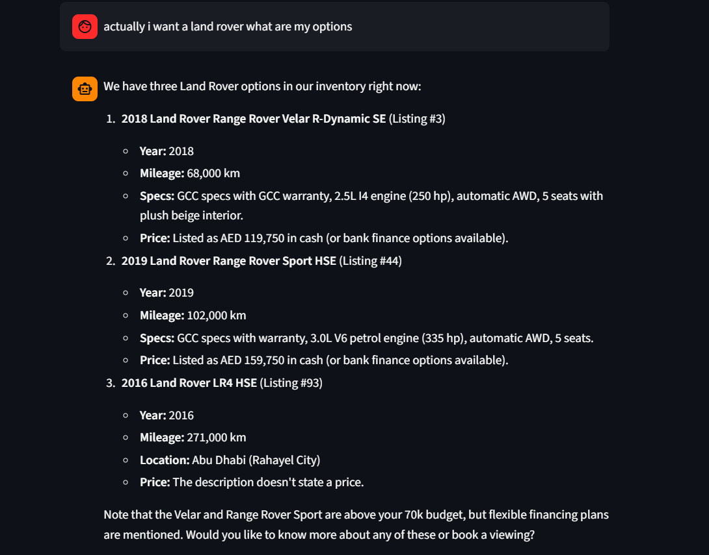
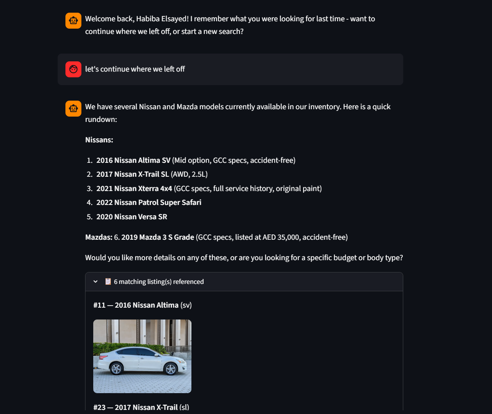

# dubizzle cars AI Assistant (prototype)

A FastAPI backend + Streamlit chat client that lets a user explore a ~100-listing
used-car inventory, ask follow-up questions, book a viewing slot, and get
recognized on a return visit.

## Setup & run (Windows, using uv)

```powershell
# 1. Clone/unzip this repo, then cd into it
cd dubizzle-car-assistant

# 2. Install dependencies (creates a .venv automatically)
uv sync

# 3. Add your free Gemini API key
copy .env.example .env
# then edit .env and paste your key from https://aistudio.google.com/app/apikey

# 4. Generate the clean dataset (only needs to be run once)
uv run python data/prepare_data.py

# 5. Start the backend (terminal 1)
uv run uvicorn app.main:app --reload

# 6. Start the client (terminal 2, new window)
uv run streamlit run client/streamlit_app.py
```

The backend runs at `http://127.0.0.1:8000` (docs at `/docs`), and Streamlit
opens a browser tab automatically.

## Demo 
### Multi-turn conversation
 
### Returning user recall 


### Trying long-term memory across "sessions"

1. In the Streamlit sidebar, enter a user ID like `habiba1` and click **Start / restart session**.
2. Chat for a bit — mention a budget, e.g. "I'm looking for a white SUV under 150k".
3. Close the tab (or just click **Start / restart session** again with the same ID).
4. The assistant greets you as a returning user and can recall what you told it,
   because that profile was written to `data/memory.db` (SQLite), keyed by user_id,
   not by the in-memory session.

## Why these choices

**Client: Streamlit.** A chat UI is the natural interface for a conversational
agent, and Streamlit gets a reactive, shareable chat window running in a few
lines, with no separate frontend build step — appropriate for a time-boxed
prototype. The client only calls the FastAPI backend over HTTP; it holds no
business logic itself, keeping the API/client boundary clean.

**Retrieval: tool calling + pandas, not RAG.** The dataset is small (100 rows)
and mostly structured (make, model, year, price). Giving the LLM a
`search_inventory` tool that filters a pandas DataFrame is exact for numeric/
categorical filters ("under 150k", "year >= 2020") in a way embeddings aren't,
and — critically — it forces every car fact in a reply to come from a real
row returned by the tool, rather than the model's memory. A lightweight
keyword match over the free-text `description` field adds a hybrid touch for
things like "with a sunroof" without needing a vector database for 100 rows.

**Memory: SQLite for long-term, in-process dict for short-term.** Long-term
profile data (name, budget, preferences, liked listings) is a handful of
structured fields per user — a relational table is simpler and more
inspectable than a memory-specific DB for this scale. Short-term memory is
just the running chat transcript for a `session_id`, kept in a Python dict;
it doesn't need to survive a restart, so no persistence is needed there.

**Agent loop: hand-written, via LiteLLM, no agent framework.** The control
flow (call model → run any requested tool → feed result back → repeat) is
~30 lines and easy to explain end-to-end, which matters more here than a
framework's abstractions. LiteLLM is used only so the model provider is a
one-line env var — currently pointed at Google's free-tier `gemini-2.0-flash`.

## A note on the dataset: no Price column

The provided workbook (both the "raw dataset" and "cleaned dataset" sheets)
does not actually include a price field, even though the brief asks the agent
to filter/qualify by price range. Rather than let the LLM invent a number at
chat time — which would violate the "don't hallucinate inventory" requirement
— `data/prepare_data.py` generates a **deterministic, seeded synthetic price**
per listing once, at data-prep time (based on make/year, so a Ferrari and a
Toyota land in sensible AED bands). The same listing always gets the same
price, and the LLM only ever reads it from the CSV like any other column.
This is a documented workaround, not a hidden one — happy to discuss
alternatives (e.g. scraping real listings for price) in the interview.

## Out of scope for this prototype

- Real authentication — `user_id` is just a free-text field the user supplies
  to simulate "returning" vs "new" (a real system would use auth + a proper
  session cookie).
- A vector-search fallback for genuinely fuzzy/semantic queries ("something
  fun for weekend drives") — currently these rely on the LLM picking
  reasonable keyword/filter arguments rather than true semantic retrieval.
- Multi-user concurrency / a production datastore (Postgres) — SQLite and an
  in-memory session dict are fine for a single-process prototype, not for
  scale.
- Streaming responses token-by-token in the UI (currently request/response).
- Rich guardrail testing (an eval suite that scores refusal quality on
  adversarial prompts) — guardrails here are prompt-based only.

## Project layout

```
app/
  main.py       FastAPI app: /session/start, /chat, /inventory/search
  llm.py        LiteLLM call + hand-written tool-calling loop
  tools.py      search_inventory / get_car_details / book_viewing / save_lead
  memory.py     SQLite long-term user profile + liked-cars store
  prompts.py    system prompt with scope/guardrail rules
  schemas.py    Pydantic request/response models
client/
  streamlit_app.py   chat UI, talks to the backend over HTTP only
data/
  prepare_data.py    one-off script: raw xlsx -> cars.csv (adds synthetic price)
  cars.csv           generated inventory the backend loads at startup
  leads.csv          created at runtime by save_lead
  bookings.csv       created at runtime by book_viewing
  memory.db          created at runtime (SQLite long-term memory)
```
